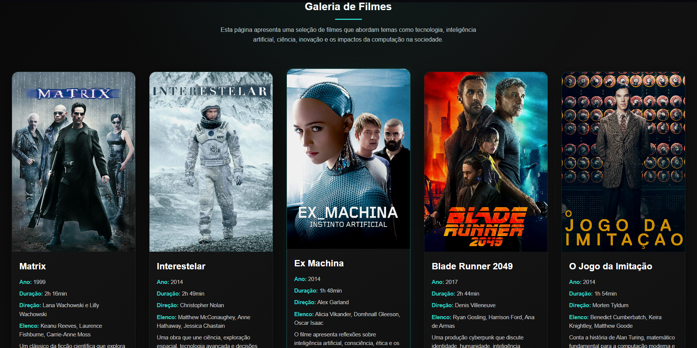

# 🎬 CineTech

Uma galeria de filmes com temática voltada para tecnologia, inteligência artificial, inovação e ficção científica.

---

## 📸 Preview do projeto



---

## 🚀 Tecnologias utilizadas

- HTML5
- CSS3
- Visual Studio Code
- Git & GitHub

---

## 🎨 Interface

O projeto possui uma interface moderna e minimalista, utilizando uma estética futurista em tons escuros com destaque em ciano.

---

## 🎞 Filmes apresentados

- Matrix
- Interestelar
- Ex Machina
- Blade Runner 2049
- O Jogo da Imitação
- A Rede Social

---

## 📁 Estrutura do projeto

```bash
cinetech-movie-gallery/
│
├── imagens/
├── index.html
├── style.css
├── preview.png
└── README.md
```

---

## 💻 Como executar o projeto

1. Faça o download dos arquivos
2. Abra a pasta no Visual Studio Code
3. Execute o arquivo `index.html` utilizando o Live Server

---

## 👨‍💻 Autor

Desenvolvido por Gustavo Brassaroto Lira.

---

## 🌐 GitHub

[🔗 Acessar repositório](https://github.com/Brassaroto/cinetech-movie-gallery)
